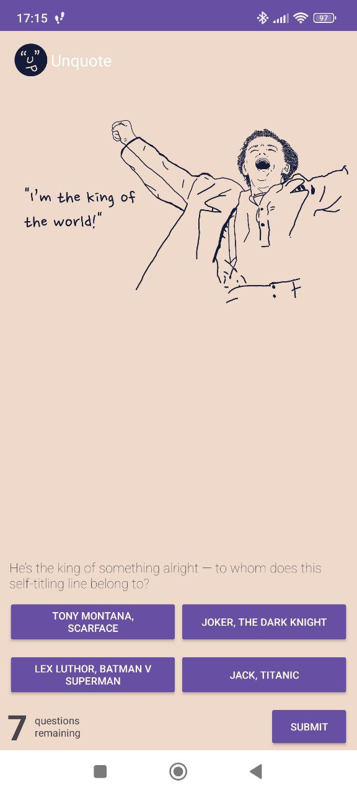

# Unquote

Simple game made in Android Studio. It can be launched on most android devices

## About the game

This is quiz game, you get a quote and have to guess who said it. There is four answers to choose from with only one corect

## Game screenshot

## References:

This game is part of course 'Build Basic Android Apps with Java' at [\*\*codecademy.com](https://www.codecademy.com/learn/paths/introduction-to-android-with-java)
